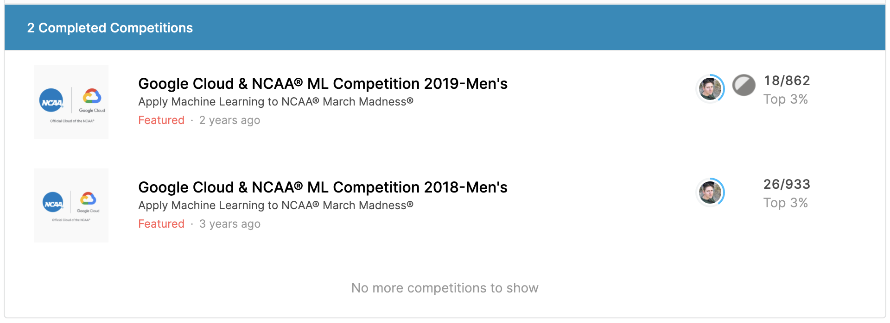

## March Madness Predictions using Kenpom and Logistic Regression

**Project description:** This project used Kenpom Adjusted Efficiency Margin differences to build a logistic regression model to predict March Madness NCAA tournament games. This model, while simple, finished top 3% in both the 2018 and 2019 Kaggle Competitions. 

For more details see [GitHub Repo](https://github.com/codywittenkeller/march_madness).
Link to [Kaggle Competitions History](https://www.kaggle.com/codywittenkeller/competitions)
